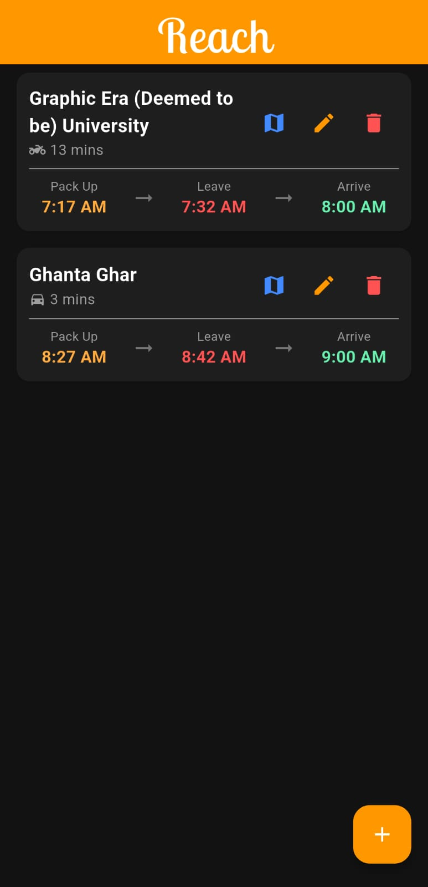
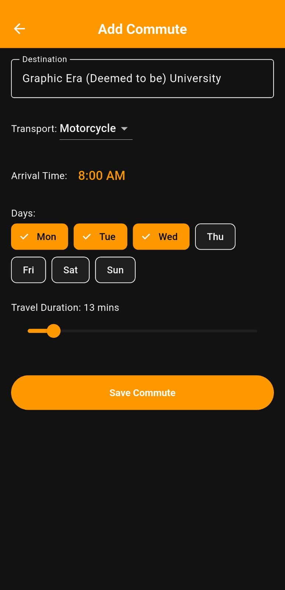

# Reach 📍
**Never miss your commute again.**

Reach is a smart commute assistant built with **Flutter**. It calculates exactly when you need to leave based on traffic and notifies you with "Pack Up" and "Leave Now" alerts so you are never late.

<p align="center">
  
  &nbsp;&nbsp;&nbsp;&nbsp;
  
</p>

## ✨ Features
* **🚗 Smart Calculations:** Automatically calculates "Leave Time" based on traffic duration.
* **🔔 Intelligent Notifications:**
    * *Pack Up Reminder:* 15 minutes before departure.
    * *Leave Now Alarm:* Urgent alert when it's time to go.
* **🌙 Modern UI:** Full Dark Mode support with high-contrast Orange accents (High-Vis style).
* **💾 Local Storage:** Persists data using `shared_preferences` so data is never lost.
* **🗺️ Live Navigation:** One-tap integration with Google Maps.

## 🛠️ Tech Stack
* **Framework:** Flutter & Dart
* **State Management:** `setState` (Optimized for performance)
* **Local Storage:** `shared_preferences`
* **Notifications:** `flutter_local_notifications`
* **Navigation:** `url_launcher` (Deep linking to Maps)

## 📥 Download
You can download the latest Android APK from the [Releases Page](https://github.com/Sparsh5126/Reach/releases).

## 🚀 Getting Started
1. Clone the repo:
   ```bash
   git clone [https://github.com/Sparsh5126/Reach.git](https://github.com/Sparsh5126/Reach.git)
2. Install dependencies:
   flutter pub get
3. Run the app:
   flutter run
