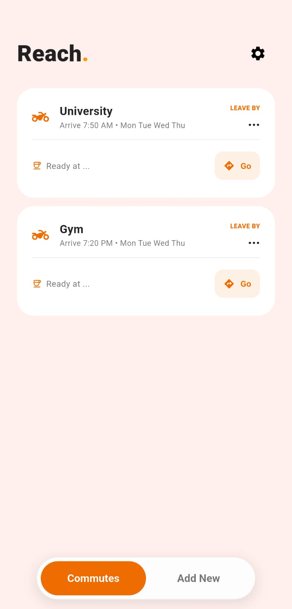
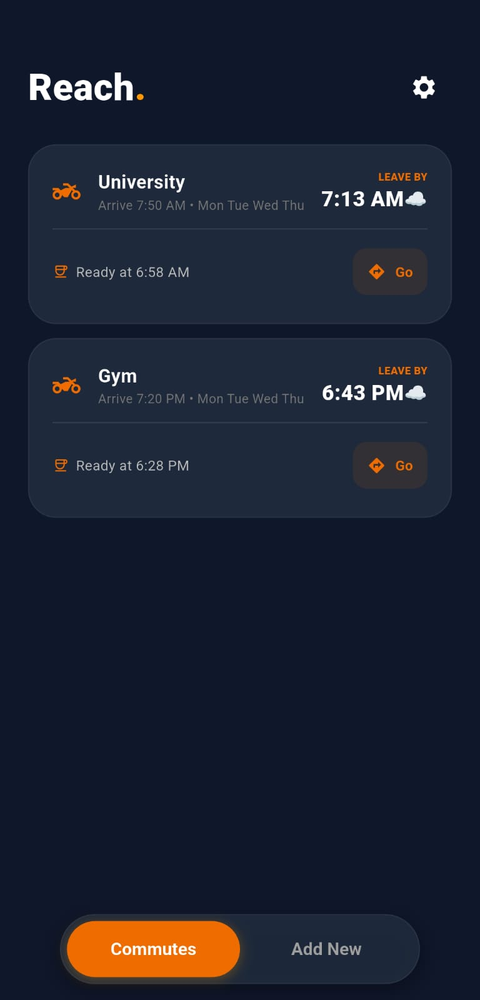
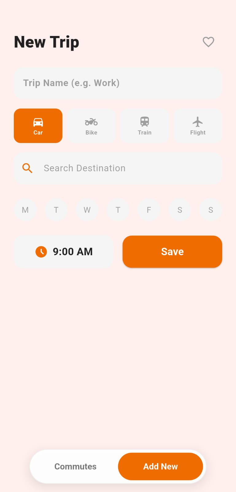
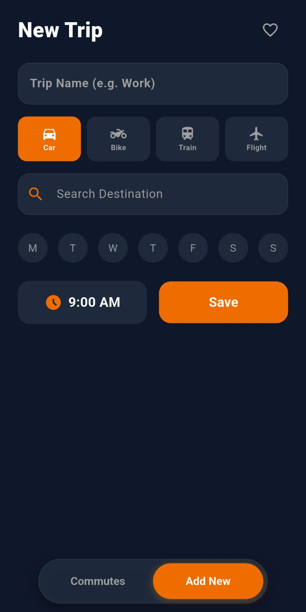

# Reach 
<p align="center">
  
</p>

<p align="center">
  <strong>Never reach late.</strong><br>
  The Smart Commute Alarm that works backwards.
</p>

<p align="center">
  <a href="https://github.com/Sparsh5126/Reach">GitHub</a>
</p>


Reach is a smart commute assistant built with Flutter. Unlike standard alarms, Reach focuses on **when you need to arrive**, calculating your precise **"Leave By"** time dynamically based on real-time traffic, weather conditions, and your chosen mode of transport.

> **"Don't leave when you think you should. Leave when you NEED to."**

---

##  Features

* **Smart Time Calculation:** Works backwards from your *Target Arrival Time*.
* **Weather & Traffic Aware:** Automatically adds buffer time if it detects rain or heavy traffic (via Mappls/MapMyIndia & OpenWeather).
* **Multimodal Support:** Includes specialized context for train and flight modes, adjusting buffer times for station and airport security, check-ins, and boarding.
* **Adaptive Learning:** Learns your personal prep time and commute history to dynamically adjust buffer times for future trips.
* **Multi-Stage Alarms:**
    1. **"Pack Up" Alert:** Nudges you 15 minutes before departure so you have time to get ready.
    2. **"Leave Now" Alarm:** Full-screen critical alert when traffic dictates you must move *now*.
* **Arrival Check-in:** Interactive notifications ask if you reached on time, feeding back into the adaptive learning engine.
* **Smart Snooze & Disable:** Easily disable individual alarms for the day or pause all alarms with a single tap if your plans change.
* **Favorites System:** Pin your most frequent commutes for quick access.
* **Calendar Sync:** Automatically scans your device calendar for upcoming events and suggests setting reach alarms for them.
* **Dynamic Theming:** UI adapts automatically based on the time of day (Deep Teal for Morning, Navy for Day, Pitch Black for Night, plus contextual weather emojis).
* **Advanced Diagnostics:** Built-in settings for notification testing, alarm simulation, and commute history management.
* **Navigation Handoff:** One-tap navigation to Google Maps or Mappls.
* **Premium Feel:** Haptic feedback on interactions, swipe-to-delete with undo, and smooth animations.

##  Tech Stack

* **Framework:** Flutter (Dart)
* **State Management:** Native `setState` & `WidgetsBindingObserver` for lifecycle management.
* **Background Services:**
    * `android_alarm_manager_plus` for precise background execution.
    * `flutter_local_notifications` for heads-up alerts.
* **Location & APIs:** `geolocator`, `http` (Custom Traffic/Weather Services).
* **Persistence:** `shared_preferences` for local data caching.

##  Screenshots

| **Home (Light)** | **Home (Dark)** |
|:---:|:---:|
|  |  |

| **Add Trip (Light)** | **Add Trip (Dark)** |
|:---:|:---:|
|  |  |

##  Getting Started

1.  **Clone the repo:**
    ```bash
    git clone [https://github.com/Sparsh5126/Reach.git](https://github.com/Sparsh5126/Reach.git)
    ```
2.  **Install dependencies:**
    ```bash
    flutter pub get
    ```
3.  **Setup Keys:**
    Create a `.env` file in the root and add your Mappls OAuth credentials:
    ```env
    MAPPLS_CLIENT_ID=your_client_id_here
    MAPPLS_CLIENT_SECRET=your_client_secret_here
    ```
4.  **Run the app:**
    ```bash
    flutter run
    ```
    *Note: Upon first launch, a one-time Privacy and Data Consent popup will require you to agree to data collection policies before permissions (Location, Calendar, Notifications) are requested.*

##  Contributing

Contributions are welcome! Please fork the repository and submit a pull request.

##  License

This project is licensed under the MIT License.