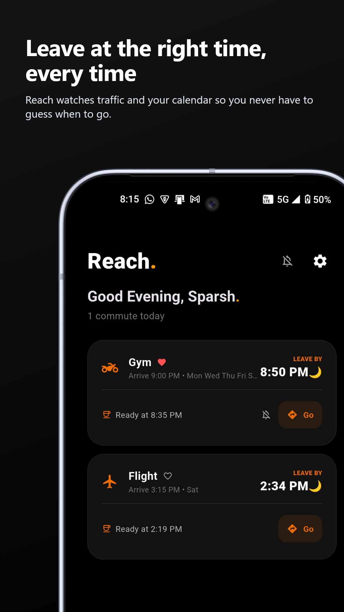
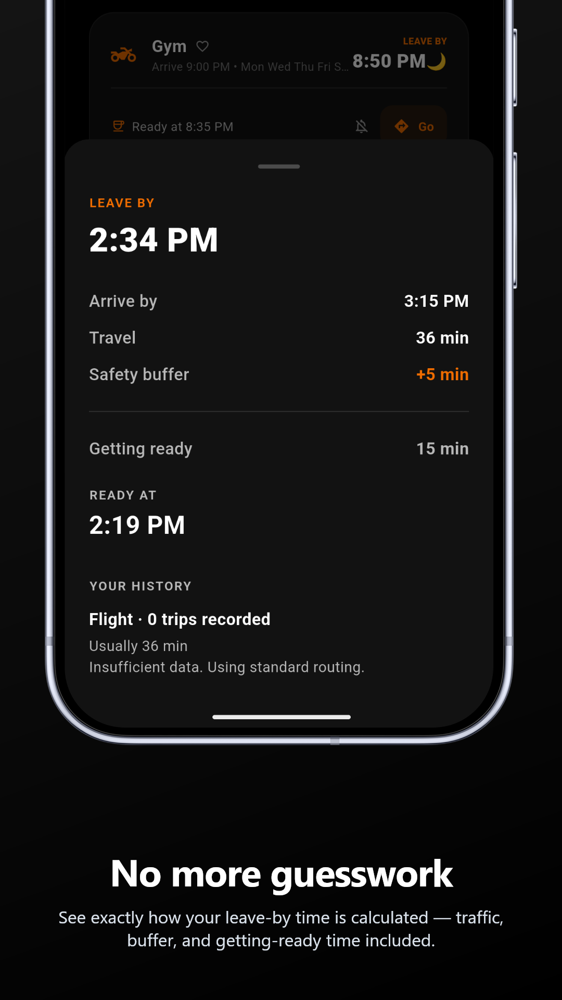
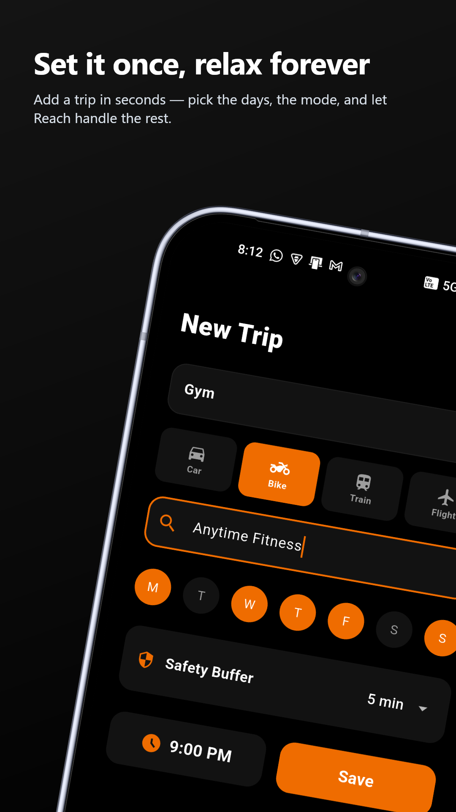
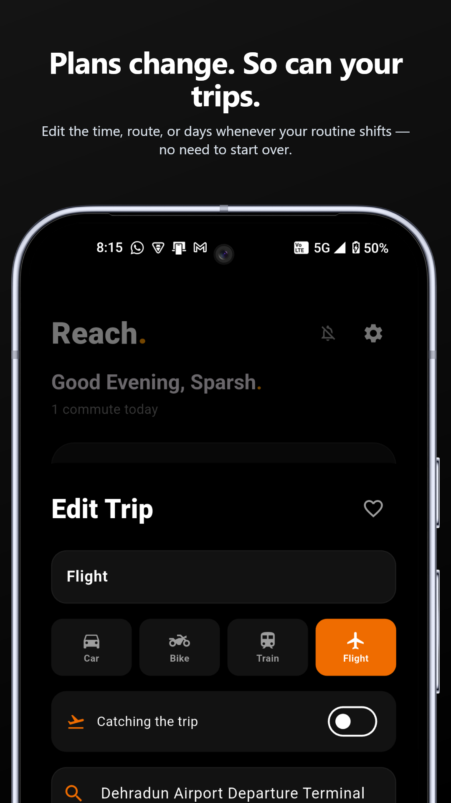
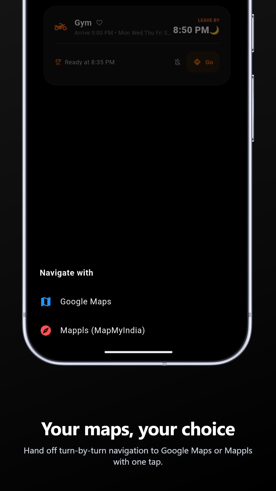
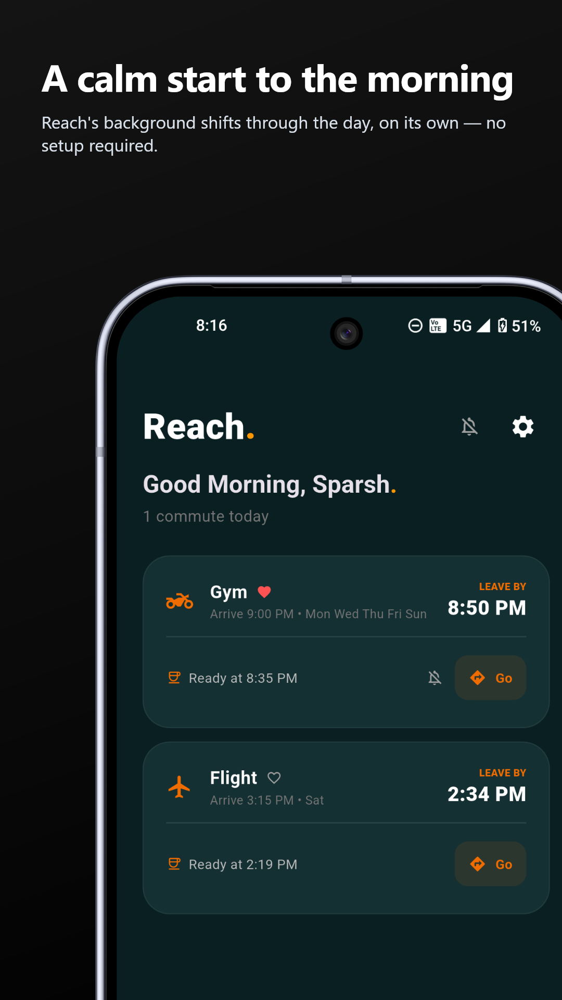
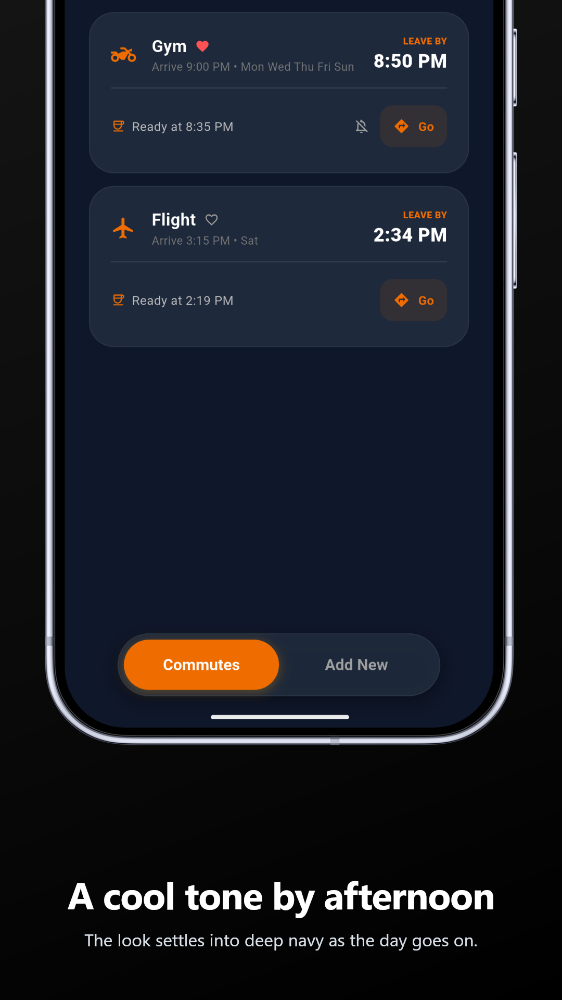
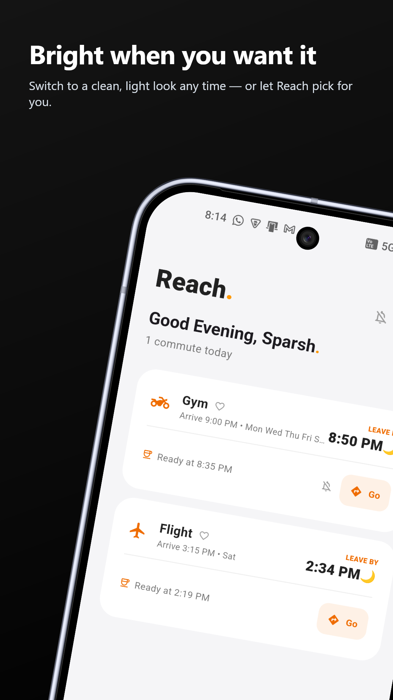
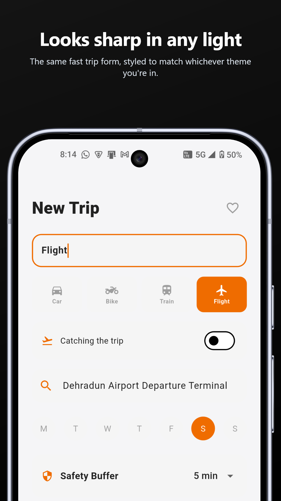
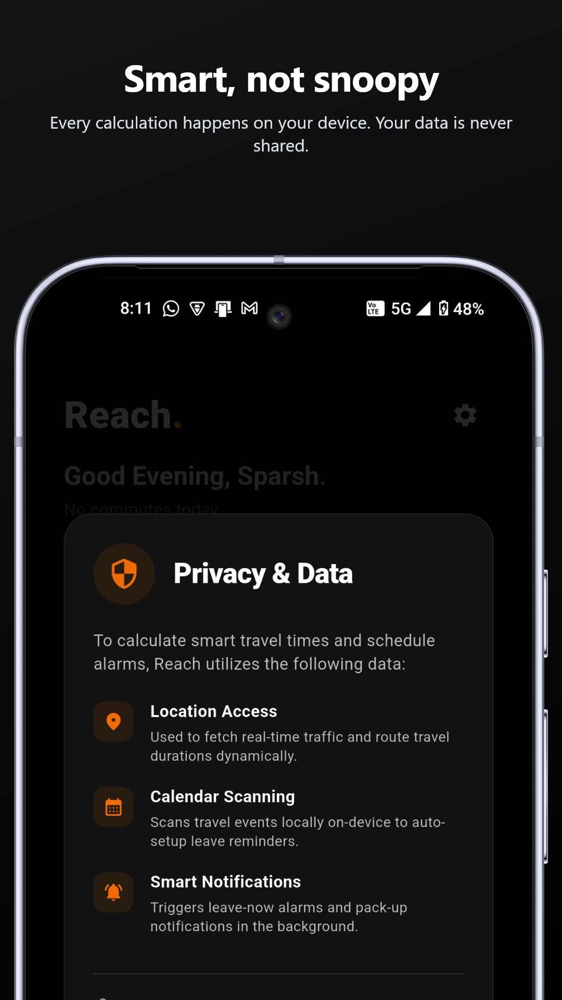

# Reach 
<p align="center">
  
</p>

<p align="center">
  <strong>Never reach late.</strong><br>
  The Smart Commute Alarm that works backwards.
</p>

<p align="center">
  <a href="https://github.com/Sparsh5126/Reach">GitHub</a>
</p>


Reach is a smart commute assistant built with Flutter. Unlike standard alarms, Reach focuses on **when you need to arrive**, calculating your precise **"Leave By"** time dynamically based on real-time traffic, weather conditions, and your chosen mode of transport.

> **"Don't leave when you think you should. Leave when you NEED to."**

---

##  Features

* **Smart Time Calculation:** Works backwards from your *Target Arrival Time* using real-time travel and custom safety margins.
* **Weather & Traffic Aware:** Dynamically adds buffer time if it detects rain or heavy traffic (via Mappls & OpenWeather).
* **Multimodal Support (Car, Bike, Train, Flight):**
    * Tailored routing profiles for Car and Bike/Motorcycle.
    * Specialized Train and Flight contexts: selectable "Catching the trip" vs "Picking someone up" with **extended safety/boarding buffers up to 2 hours**.
* **Adaptive Learning Engine:** Records trip check-ins to build a personal history per commute and per mode, intelligently blending your historical median travel times with routing estimates.
* **Interactive Time Breakdown:** Tap any commute card to inspect how your "Leave By" and "Ready At" times were calculated (travel duration, rain adjustment, safety buffer, and history tier).
* **Multi-Stage Alarms:**
    1. **"Pack Up" Alert:** Nudges you during your customizable prep window (default 15 min) so you have time to get ready.
    2. **"Leave Now" Full-Screen Alarm:** Wake-the-screen slider alarm when live conditions dictate you must move *now* (configurable in Settings).
* **Arrival Check-in:** Interactive notifications ask if you reached on time, feeding back into the adaptive learning engine.
* **Smart Snooze & Disable Controls:** Silence today's alarms for individual trips or pause all of today's alarms with a single tap from the home screen without affecting future days.
* **Calendar Sync:** Scans device calendars for upcoming events with locations and suggests creating Reach alarms with one tap.
* **Favorites & Gestures:**
    * Pin top commutes with the heart icon.
    * Double-tap any card to edit; swipe left to delete with an instant Undo option.
* **Dynamic Theming:** UI adapts smoothly based on the time of day (Deep Teal for Morning, Navy for Day, Pitch Black for Night, plus contextual weather & night icons).
* **Navigation Handoff:** One-tap navigation opening Google Maps or Mappls directly to your destination.
* **Settings & Diagnostics:** Customize prep times, toggle full-screen wake alarms, review or reset commute learning history, and read the built-in Features & Gestures Guide.

##  Tech Stack

* **Framework:** Flutter (Dart)
* **State Management:** Native `setState` & `WidgetsBindingObserver` for lifecycle management.
* **Background Services:**
    * `android_alarm_manager_plus` for precise background execution.
    * `flutter_local_notifications` for heads-up alerts.
* **Location & APIs:** `geolocator`, `http` (Mappls Routing & Places, OpenWeatherMap).
* **Calendar:** `device_calendar` for detecting upcoming travel events.
* **Persistence:** `shared_preferences` for commute storage and learned trip history.

##  Screenshots

<table>
  <tr>
    <td></td>
    <td></td>
    <td></td>
    <td></td>
    <td></td>
    <td></td>
    <td></td>
    <td></td>
    <td></td>
    <td></td>
  </tr>
</table>

##  Getting Started

1.  **Clone the repo:**
    ```bash
    git clone https://github.com/Sparsh5126/Reach.git
    ```
2.  **Install dependencies:**
    ```bash
    flutter pub get
    ```
3.  **Setup Keys:**
    Create a `.env` file in the root directory and add your Mappls and API credentials:
    ```env
    MAPPLS_CLIENT_ID=your_client_id_here
    MAPPLS_CLIENT_SECRET=your_client_secret_here
    MAPPLS_API_KEY=your_mappls_rest_api_key_here
    ```
4.  **Run the app:**
    ```bash
    flutter run
    ```
    *Note: Upon first launch, a one-time Privacy and Data Consent popup will require you to agree to data collection policies before permissions (Location, Calendar, Notifications) are requested.*

##  Contributing

Contributions are welcome! Please fork the repository and submit a pull request.

##  License

This project is licensed under the MIT License.